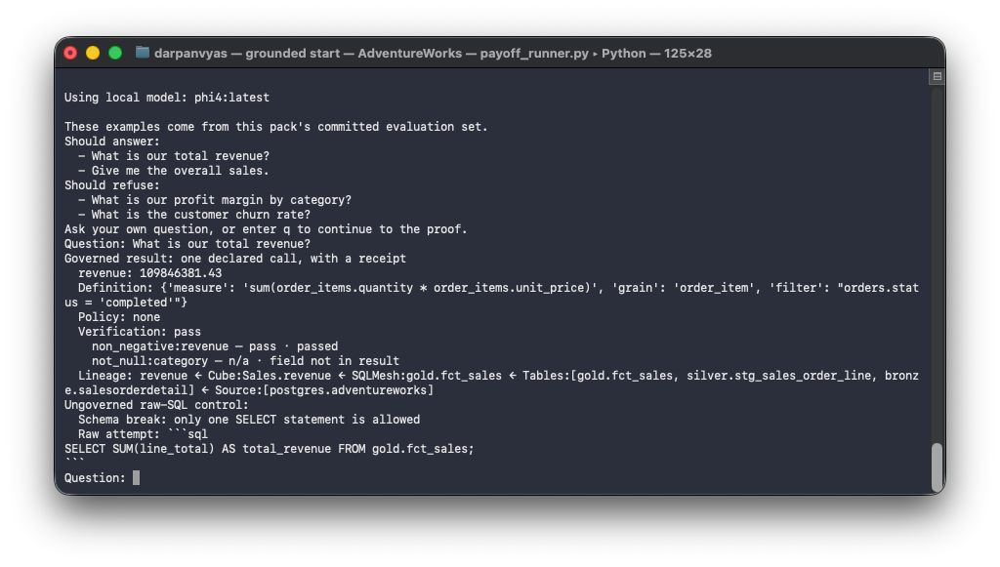

# Grounded


[](LICENSE)


Grounded is a reference build for governed data agents: instead of asking a model to write unrestricted SQL, it validates one declared MCP tool call, executes a governed metric, applies policy, verifies the result, records an audit event, and returns a lineage citation. Because the agent can invoke only declared metric calls, it cannot author free-form SQL at the boundary. Selecting the wrong declared call remains possible, so routing and coverage still depend on model quality and are measured, not assumed.



*The `make start` payoff: a governed answer carries verification and lineage evidence; the raw-SQL control schema-breaks on the same question.*

<!-- asset pending: docs/assets/quickstart-payoff.png -->

## Architecture

<!-- diagram: embed IG1 architecture PNG when ready -->

```
PostgreSQL (AdventureWorks, TPC-H) or SQLite (Spider, BIRD)
  → dlt → DuckDB (bronze → silver → gold) → SQLMesh → Cube
  → governed MCP harness → local agent
                     └→ OpenLineage → Marquez lineage API and UI
```

DuckDB is the embedded analytical engine. The governed layer owns contracts, metric resolution, policy enforcement, verification, audit, citations, and the evaluation harness; it does not claim to own identity or sandboxing.

The diagram groups the stack by job: PostgreSQL and SQLite are sources; dlt, DuckDB, and SQLMesh move and transform data; Cube is the semantic service; the MCP harness is the governed interface; and OpenLineage plus Marquez provide lineage evidence.

## Start here

Run `make start` for a guided, single-terminal tour of data movement, transformation, the semantic layer, metric tree, lineage, and policy, then ask a local model a question and see its governed answer and receipt beside what raw SQL does without the boundary.

For full clone-to-demo detail, read [QUICKSTART.md](QUICKSTART.md); use `make demo` for the fast deterministic walkthrough, or `make spine-all` for the local pack spines after configuring a source DSN.

## Prerequisites & Dependencies

To run the guided quickstart (`make start`) or individual pipeline targets, your host needs:

| Dependency | Required version | Purpose |
| --- | --- | --- |
| Python | 3.11–3.13 | Runtime for DuckDB, SQLMesh, dlt, and the governed harness. Python 3.14 lacks binary wheels for some dependencies. |
| Docker Desktop | Current release | Required for the AdventureWorks and TPC-H full tours, which run PostgreSQL, Cube, and Marquez. It is not required for the Fixture quick run. |
| Ollama | Current release | Local model runtime. Install it from [ollama.com](https://ollama.com). The CLI recommends the strongest supported installed model because it most reliably returns computed answers. |
| Free disk | ≥ 5 GiB | Docker images and local analytical storage. |
| Local ports | 5433, 4000, 3000 | PostgreSQL source, Cube, and Marquez UI. The CLI detects collisions and offers alternate ports. |

## What is measured

The benchmark asks five dataset packs (AdventureWorks, TPC-H, Spider world_1, BIRD california_schools, and a deterministic fixture) the same governed questions across up to nine local models, three runs each, and scores four things independently: whether the executed answer matches an independently computed expected answer, whether the output is well formed, whether policy scope holds, and whether the promised evidence (definition, verification, lineage) is present. Expected answers come from an independent query path, not the governed resolver under test, and an evaluator self-test that seeds a wrong metric, wrong period, duplicate result, missing evidence, and forbidden scope must pass before any score is recorded.

Because the model routes a declared call instead of authoring SQL, it cannot fabricate a free-form query at the boundary; it can still select the wrong declared call, so that error is measured rather than assumed. For the capable models (gemma2:9b, phi4, qwen2.5:14b, qwen2.5:7b), governed correct-when-answered ranged from 78.9% to 94.3% on AdventureWorks, 93.4% to 98.7% on TPC-H, 96.8% to 100% on Spider world_1, and 95.2% to 100% on BIRD california_schools; governed wrong-answer rates ran from the low single digits up to about 21% on AdventureWorks. The raw-SQL control arm was far less accurate on every pack, but not uniformly near-zero: when the same two-decimal rounding is applied to both arms, raw-SQL correctness reaches roughly 6–22% on AdventureWorks, stays at 0% on TPC-H, and runs low on Spider world_1 and BIRD (about 0–15%). The TPC-H raw failures are genuine wrong answers — incorrect aggregations and joins, plus references to columns the gold schema dimensionalized away — diagnosed case by case, not a rounding artifact. Governed correctness remains decisively higher than the raw-SQL arm on every pack. Run variance was effectively zero at temperature zero. Full methodology, tables with denominators, and the disclosed comparison caveats are in [benchmarks.md](docs/benchmarks.md).

## Read the design

- [Whitepaper](docs/whitepaper.md): the thesis and the measured evidence.
- [Integration](docs/integration.md): the runtime seams and pack lifecycle.
- [Foundations](docs/foundations.md): what is bought and what Grounded builds.
- [AI strategy](docs/ai-strategy.md): the governance-versus-identity boundary.
- [Benchmarks](docs/benchmarks.md): evaluation method and results.
- [MCP tools](docs/mcp-tools.md), [metrics](docs/metrics.md), and [error analysis](docs/error-analysis.md): operational contracts and failure evidence.
